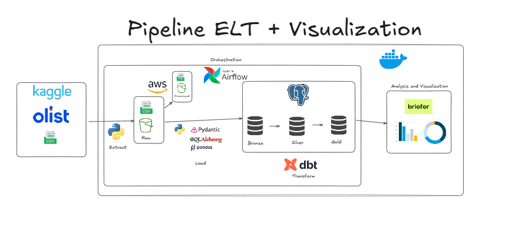

# Data Warehouse Olist Project



## Overview

This project implements a data lake architecture for the Olist dataset. The pipeline extracts data from Kaggle, uploads it to an S3 bucket, validates the files and then loads it into a PostgreSQL database. Processed files are moved to the processed folder in the S3 bucket. The data is further transformed using DBT and visualized using Briefer.

## Architecture

The architecture of the project is depicted in the image above. It consists of the following components:
- **Kaggle**: Source of the raw data.
- **S3 Bucket**: Storage for raw and processed data.
- **Pydantic**: File schema validation
- **SQLAlchemy**: ORM
- **PostgreSQL**: Database for storing the transformed data.
- **DBT**: Tool for data transformation.
- **Briefer**: Tool for data visualization.
- **Airflow**: Orchestration tool for managing the data pipeline.

## Setup

### Prerequisites

- Python 3.12+
- Docker
- Docker Compose
- AWS CLI
- Kaggle API Key


### Clone the repository

`git clone https://github.com/mvgentil/data_olist.git`

`cd data_olist`

### Environment Variables

Create a `.env` file in the root directory with the following variables (you can also use the .env.example file):

```env
AWS_ACCESS_KEY_ID=your_aws_access_key_id
AWS_SECRET_ACCESS_KEY=your_aws_secret_access_key
AWS_REGION=your_aws_region
BUCKET_NAME=your_s3_bucket_name

DB_NAME=your_postgres_db_name
DB_USER=your_postgres_user
DB_PASSWORD=your_postgres_password
DB_HOST=your_postgres_host
DB_PORT=your_postgres_port

KAGGLE_USERNAME=your_kaggle_username
KAGGLE_KEY=your_kaggle_key
```

### Docker Setup
Build and start the Docker containers:

`docker-compose up --build`


### TODO

## DBT -> Transformations
## Airflow -> Orchestration
## Briefer -> Visualization